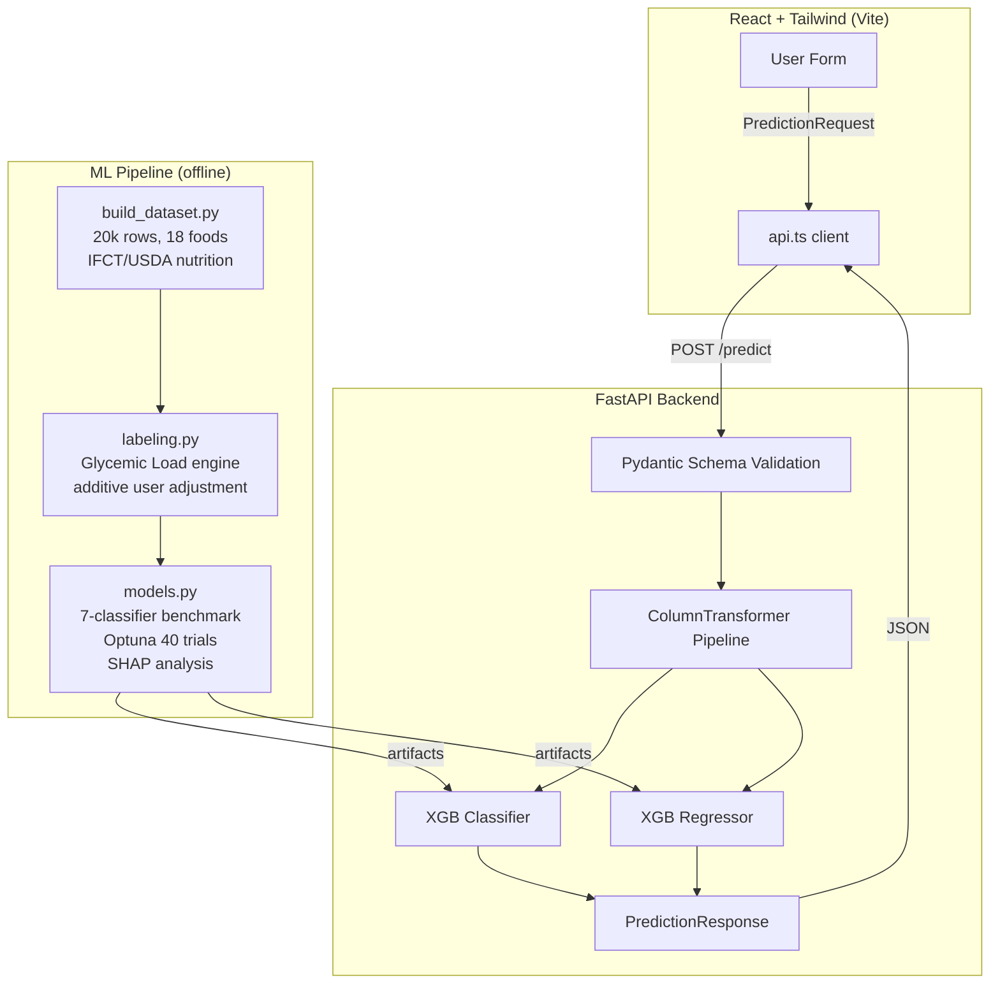

<p align="center">
  
  
  
  
  
</p>

<h1 align="center">Aharamitra</h1>

<p align="center">
  <strong>AI-Based Food Risk & Safe-Portion Intelligence System</strong><br/>
  Predicts glucose-spike risk and personalized safe portion sizes for Indian festival foods<br/>using glycemic-load science, XGBoost, and a full-stack React + FastAPI interface.
</p>

---

## Table of Contents

- [Problem & Motivation](#problem--motivation)
- [Architecture](#architecture)
- [Quickstart](#quickstart)
- [Project Structure](#project-structure)
- [Dataset](#dataset)
- [ML Pipeline](#ml-pipeline)
- [Model Performance](#model-performance)
- [API Reference](#api-reference)
- [UI Screens](#ui-screens)
- [Design Decisions](#design-decisions)
- [Future Work](#future-work)
- [License](#license)

---

## Problem & Motivation

India has 101 million people with diabetes and another 136 million prediabetic. Festival seasons see a dramatic spike in post-meal glucose due to traditional sweets that are carbohydrate-dense and high-GI. Most people — even those managing diabetes — lack a tool that answers:

> *"For **my** body, **this** specific sweet, **right now** — how much can I safely eat?"*

Aharamitra bridges this gap by combining **food glycemic science** (real IFCT/USDA nutritional data) with **personal health context** (BMI, diabetes status, fasting state, age) to produce:

1. **Glucose-spike risk classification** (low / moderate / high / very-high)
2. **Personalized safe portion count** grounded in glycemic-load thresholds

---

## Architecture



---

## Quickstart

### Prerequisites

- **Python 3.11+** (tested on 3.13)
- **Node.js 18+** (for the UI)

### 3-Command Setup

```bash
# 1. Clone the repository
git clone https://github.com/ahhbhishek/aharamitra-ai.git
cd aharamitra-ai

# 2. Create a virtual environment and install everything
python -m venv .venv
# Windows
.venv\Scripts\activate
# macOS / Linux
source .venv/bin/activate

pip install -e ".[api,dev]"
make data          # Generate the enriched 20k-row dataset
make train         # Full benchmark → Optuna tuning → final model train

# 3. Install the React UI and start both services
cd ui
npm install
npm run dev        # Starts Vite dev server on :5173

# In another terminal, start the API:
cd ..              # back to project root
make serve         # FastAPI on :8000
```

Open **http://localhost:5173** — select a food, adjust your health sliders, and hit **Predict**.

> **Without the UI:** Just run the API with `make serve` and test with the Swagger docs at **http://localhost:8000/docs**.

### Makefile Cheatsheet

| Command | Description |
|---------|-------------|
| `make install` | Install project + API + dev deps |
| `make data` | Regenerate enriched dataset (20k rows) |
| `make train` | Full benchmark + Optuna tuning + evaluation |
| `make train-quick` | Train without benchmark/tuning (fast iteration) |
| `make predict` | Run a sample prediction from CLI |
| `make serve` | Start FastAPI server (uvicorn, port 8000) |
| `make test` | Run pytest |
| `make clean` | Remove all generated artifacts |

---

## Project Structure

```
aharamitra-ai/
├── api/                        # FastAPI application
│   └── main.py                 # Endpoints: /health, /foods, /predict
├── data/
│   ├── raw/                    # Original synthetic dataset (backed up)
│   └── processed/
│       └── aharamitra_v2.csv   # 20k-row enriched dataset
├── models/                     # Saved model artifacts (.joblib, .json)
├── reports/                    # Benchmark CSVs, plots (confusion matrix, SHAP)
├── src/aharamitra/             # Core Python package
│   ├── __init__.py
│   ├── build_dataset.py        # Dataset generator with seeded RNG
│   ├── config.py                # Pydantic Settings (paths, features, defaults)
│   ├── features.py              # ColumnTransformer + sklearn Pipeline factory
│   ├── foods.py                 # 18 foods with real IFCT/USDA nutrition data
│   ├── labeling.py              # Glycemic-load labeling engine
│   ├── models.py                # Benchmark, Optuna tuning, training, SHAP
│   ├── schemas.py               # Pydantic request/response models
│   ├── train.py                 # Typer CLI (train + predict commands)
│   └── utils.py                 # structlog configuration
├── ui/                          # React + TypeScript + Tailwind frontend
│   ├── src/
│   │   ├── App.tsx              # Main SPA with gauge, form, results
│   │   ├── api.ts               # Typed API client
│   │   ├── index.css            # Tailwind + custom styles
│   │   └── main.tsx             # React 18 entry point
│   └── package.json             # Vite 5, React 18, Tailwind 3
├── tests/                       # Test suite (pytest)
├── .gitignore
├── Makefile                     # All common commands
├── pyproject.toml               # Python package config
└── README.md
```

---

## Dataset

### Construction

The dataset (`data/processed/aharamitra_v2.csv`) is **programmatically generated** with a seeded RNG for full reproducibility. Each row is built by:

1. **Sampling a user profile** — age (18–80), BMI (Gaussian mixture centered around 25.5), diabetes probability (age/BMI-dependent, ~11% base), fasting state (45% positive)
2. **Selecting a food** — from 18 Indian festival foods; 70% of users eat food from their home region, 30% cross-region
3. **Adding realistic noise** — 6–15% per-sample jitter on food nutritional values (simulating real-world measurement variance)
4. **Computing Glycemic Load** — `GL = GI × available_carbs / 100`
5. **Labeling** — applying medically-grounded additive GL adjustments for user health context, then mapping to risk bands

### Foods (18 items)

Steamed Modak, Besan Ladoo, Sakkarai Pongal, Payasam, Dates, Sheer Khurma, Kada Prasad, Ayambil Khichdi, Plum Cake, Gujiya, Mysore Pak, Chana Dal Halwa, Coconut Ladoo, Rava Ladoo, Puran Poli, Ghevar, Rava Kesari, Dry Fruit Barfi

Nutrition data sourced from **IFCT (Indian Food Composition Tables)** and **USDA FoodData Central**.

### Features (16 input columns)

| Feature | Type | Description |
|---------|------|-------------|
| `age` | numeric | User age (years) |
| `bmi` | numeric | Body mass index |
| `bmi_category` | categorical | underweight / normal / overweight / obese |
| `diabetes_status` | numeric | 0 = non-diabetic, 1 = diabetic |
| `fasting_state` | numeric | 0 = not fasting, 1 = fasting |
| `festival` | categorical | Associated festival |
| `region` | categorical | User's region |
| `food_name` | categorical | Selected food item |
| `glycemic_index` | numeric | GI of the food |
| `carbs_per_item_g` | numeric | Available carbohydrates per portion (g) |
| `sugar_per_item_g` | numeric | Total sugars per portion (g) |
| `protein_per_item_g` | numeric | Protein per portion (g) |
| `fat_per_item_g` | numeric | Fat per portion (g) |
| `fiber_per_item_g` | numeric | Dietary fiber per portion (g) |
| `energy_per_item_kcal` | numeric | Energy per portion (kcal) |
| `glycemic_load` | numeric | Computed: GI × carbs / 100 |

### Labeling Engine

Risk is determined by **effective glycemic load**:

```
effective_GL = base_GL + adjustment(diabetes, BMI, fasting, age)
```

**Additive adjustments** (chosen over multiplicative to prevent overlapping risk bands):
- Diabetes: **+3.5**
- BMI > 25: up to **+3.0** (proportional)
- Fasting: **+1.5** / Not fasting: **−0.8**
- Age > 40: up to **+2.0** (proportional)

**Risk bands**:
| Risk Band | Effective GL Threshold |
|-----------|------------------------|
| **Low** | ≤ 11 |
| **Moderate** | 11 < GL ≤ 15 |
| **High** | 15 < GL ≤ 19 |
| **Very High** | > 19 |

---

## ML Pipeline

### Preprocessing

- `ColumnTransformer` with `OneHotEncoder(handle_unknown='ignore', sparse_output=False)` for categorical features, passthrough for numeric
- Wrapped in `sklearn.pipeline.Pipeline` with the estimator — ensures no data leakage during CV

### Benchmark (7 classifiers × 6 regressors)

All models evaluated with **5-fold stratified cross-validation** (StratifiedKFold for classification, KFold for regression):

| Classifier | Accuracy | F1 (macro) | ROC-AUC (OvR) |
|------------|----------|------------|----------------|
| **LightGBM** | 97.14% | 0.972 | 0.9985 |
| **XGBoost** | 97.12% | 0.972 | 0.9986 |
| GradientBoosting | 96.88% | 0.969 | 0.9981 |
| RandomForest | 93.29% | 0.934 | 0.9934 |
| MLP | 92.76% | 0.929 | 0.9928 |
| LogisticRegression | 92.08% | 0.917 | 0.9907 |

| Regressor | RMSE | MAE | R² |
|-----------|------|-----|-----|
| **LightGBM** | 0.143 | 0.113 | 0.954 |
| **XGBoost** | 0.143 | 0.113 | 0.954 |
| GradientBoosting | 0.143 | 0.115 | 0.954 |
| RandomForest | 0.148 | 0.116 | 0.951 |
| MLP | 0.208 | 0.162 | 0.902 |
| SVR | 0.314 | 0.220 | 0.778 |

### Hyperparameter Tuning (Optuna)

- **40 trials** per model (classifier + regressor)
- 9+ hyperparameters: `n_estimators`, `max_depth`, `learning_rate`, `subsample`, `colsample_bytree`, `min_child_weight`, `gamma`, `reg_alpha`, `reg_lambda`
- Objective: `f1_macro` for classifier, `neg_rmse` for regressor

### Final Tuned Model Performance (test set, n=4,000)

**Risk Classifier (XGBoost, Optuna-tuned):**

| Metric | Value |
|--------|-------|
| Accuracy | **97.80%** |
| F1 (macro) | **0.978** |
| ROC-AUC (OvR, weighted) | **0.999** |

Per-class breakdown:

| Class | Precision | Recall | F1 | Support |
|-------|-----------|--------|-----|---------|
| Low | 0.987 | 0.980 | 0.983 | 542 |
| Moderate | 0.961 | 0.981 | 0.971 | 930 |
| High | 0.975 | 0.970 | 0.973 | 1,277 |
| Very High | 0.990 | 0.983 | 0.987 | 1,251 |

**Portion Regressor (XGBoost, Optuna-tuned):**

| Metric | Value |
|--------|-------|
| MAE | **0.112** |
| RMSE | **0.142** |
| R² | **0.956** |

### SHAP Analysis

Feature importance is analyzed using TreeSHAP and saved as `reports/feature_importance_shap.png`. Top contributors to risk prediction: `glycemic_load`, `diabetes_status`, `bmi`, `fasting_state`, `sugar_per_item_g`.

### Transparency Note

The high accuracy (97.8%) is partly because labels are generated by a deterministic rule from features that include `glycemic_load` — the model successfully learns the clinical glycemic-load framework. This should be interpreted as: *the model reliably captures the clinical reasoning*, not as out-of-sample generalization to unseen populations. Real-world validation with CGM (continuous glucose monitor) data is the recommended next step.

---

## API Reference

Base URL: `http://localhost:8000`

### `GET /health`
Health check. Returns version and status.

### `GET /foods`
Returns the full list of 18 festival foods with nutritional data.

### `GET /regions`
Returns available regions.

### `POST /predict`

**Request body:**
```json
{
  "age": 45,
  "bmi": 27.5,
  "diabetes_status": 1,
  "fasting_state": 0,
  "bmi_category": "overweight",
  "festival": "Ganesh Chaturthi",
  "region": "Maharashtra",
  "food_name": "Steamed Modak",
  "glycemic_index": 60,
  "carbs_per_item_g": 20,
  "sugar_per_item_g": 10,
  "protein_per_item_g": 2.5,
  "fat_per_item_g": 3.2,
  "fiber_per_item_g": 1.8,
  "energy_per_item_kcal": 120
}
```

**Response:**
```json
{
  "risk": "high",
  "confidence": 0.95,
  "safe_portion": 1.3,
  "risk_probabilities": {
    "low": 0.01,
    "moderate": 0.04,
    "high": 0.95,
    "very_high": 0.00
  }
}
```

Interactive docs available at **http://localhost:8000/docs** (Swagger UI).

---

## UI Screens

The React interface provides:

- **Food & Region Selection** — dropdown with nutritional preview card
- **Health Profile Sliders** — age (18–80), BMI (15–45), diabetes/fasting toggles
- **Risk Gauge** — animated SVG semicircle gauge (0–100), color-coded by risk level
- **Portion Meter** — horizontal bar showing safe portion count, color-coded by safety margin
- **Actionable Recommendation Text** — generated from the prediction results

---

## Design Decisions

| Decision | Rationale |
|----------|-----------|
| **Additive GL adjustment** (not multiplicative) | Multiplicative factors (0.6–2.0×) caused overlapping risk bands and unrealistic extremes. Additive constants (+1 to +3.5) keep food as primary driver while personalizing cleanly. |
| **OneHotEncoder** over LabelEncoder for features | Original code used LabelEncoder on nominal categoricals, implying ordinal relationships that don't exist. OneHotEncoder is the correct approach for sklearn pipelines. |
| **StratifiedKFold** for classifiers, **KFold** for regressors | Classification targets are ordinal classes (stratifiable). Regression targets are continuous floats (can't stratify). |
| **Glycemic Load** as both feature and label source | GL is the scientifically validated predictor of postprandial glucose response (International Tables of Glycemic Index, 2021). Using it transparently rather than a black-box synthetic label makes the system clinically interpretable. |
| **Seeded RNG** for dataset generation | Full reproducibility — anyone can regenerate the exact same dataset. Critical for scientific credibility. |
| **No pre-trained CGM model** | Existing glucose-prediction models (Glucobot, DeepGLucose, etc.) require CGM time-series input. Our tabular approach (food + user features → risk) serves a different use case: **pre-meal planning** without continuous monitoring hardware. |
| **FastAPI + React** over Flask + Jinja | Separate API and SPA enables independent iteration, type-safe API client in TypeScript, and Swagger docs out of the box. |

---

## Future Work

- [ ] **Real-world validation** — pilot study with CGM data to validate predicted risk bands against actual post-meal glucose
- [ ] **Expanded food database** — scale from 18 to 200+ Indian foods with crowd-sourced IFCT entries
- [ ] **Multi-food meal modeling** — predict risk for combinations (e.g., "Ladoo + Chai")
- [ ] **Docker Compose** for one-command local deployment
- [ ] **PWA** for offline-capable mobile use during festivals
- [ ] **Fairness audit** — evaluate performance across age groups, BMI categories, and regions

---

## License

This project is licensed under the **MIT License** — see the [LICENSE](LICENSE) file for details.
